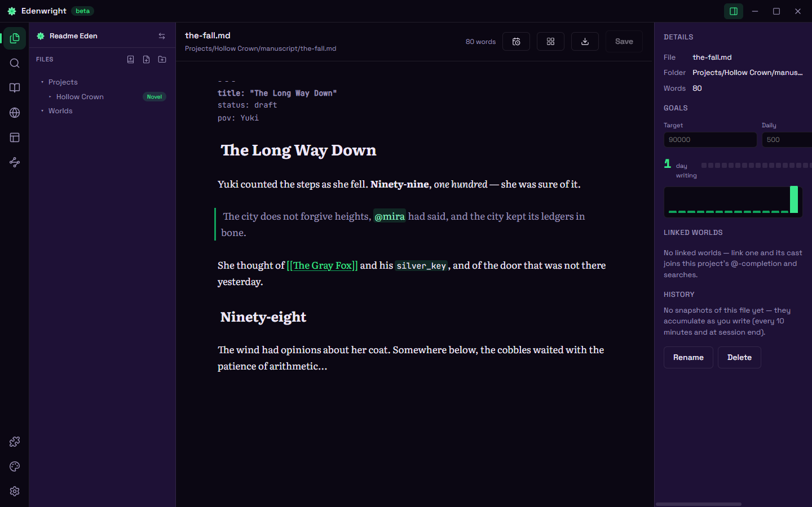

# Edenwright

**An open-source desktop studio for every kind of story** — one unified writer where every medium shares one story skeleton. Novels, comics, screenplays, story-games, worldbuilding. Plain files you own forever.

Made by [Lablooms Studio](https://github.com/lablooms). MIT, everything.



## The idea

Like Obsidian, but built solely for writers. One eden = one story: a plain folder holding a tree of Markdown documents, one `world/` for the codex layer, and an `eden.json` — and the difference between a novel, a manga, and a screenplay is **a preset: pure data**. ~20 presets come built in (what your documents are called, which folders appear, which fields stamp). Medium-specific _powers_ — screenplay formatting, comic panel rails, a story canvas, Fountain/Ren'Py exports — ship as built-in core plugins, on by default.

## The plain-files promise

Everything you write lives as human-readable Markdown and JSON in a normal folder — your **eden**. The SQLite index is a disposable cache; delete it and lose nothing. No accounts, no cloud, no telemetry. Your words are yours.

## What's inside

- **The editor** — CodeMirror live preview with a formatting toolbar (no markdown degree required), `[[wiki-links]]` + `@mentions`, spellcheck, typewriter mode, smart typography, focus mode, quick switcher, global search.
- **The World tab** — typed entity sheets with appearances, one-click creation for characters/places/items/factions/lore; plus timeline, corkboard, goals & streaks, snapshot history with diffs and restore.
- **Universal exports** — manuscript Word, EPUB, PDF, clean Markdown, single-file HTML, Markdown zip. Medium serializations (Fountain, FDX, Ren'Py, Twee, comic script) come with the built-in Medium Exporters core plugin.
- **Plugins & themes** — eight first-party core plugins built in, folder-installed plugins with a trust dialog and restricted mode (community plugin shelf coming after beta), and a registry-backed community themes shelf. Plus [plugin dev docs](docs/plugins/README.md).

## Docs

- [User guide](docs/user-guide.md) — the whole app in walking order
- [SPEC.md](SPEC.md) — the product & build specification (v2)
- [AGENTS.md](AGENTS.md) — standing law for contributors
- [CHANGELOG.md](CHANGELOG.md) — serious tool, silly changelog
- [CONTRIBUTING.md](CONTRIBUTING.md) — dev setup and the house rules

## Develop

Requires **Node ≥ 22** and **pnpm ≥ 9**.

```sh
pnpm install      # bootstrap the monorepo
pnpm dev          # run the desktop app in dev (hot reload)
pnpm lint         # eslint (includes the Portable Core Law rule) + prettier check
pnpm typecheck    # tsc --noEmit across workspaces
pnpm test         # vitest unit tests
pnpm test:e2e     # Playwright against the built app
pnpm test:registry # validate the bundled registry fixture
pnpm build        # production build of all packages
pnpm package      # electron-builder for your current OS
```

## License

MIT — app, plugin API, and sample plugins alike. See [LICENSE](LICENSE).
